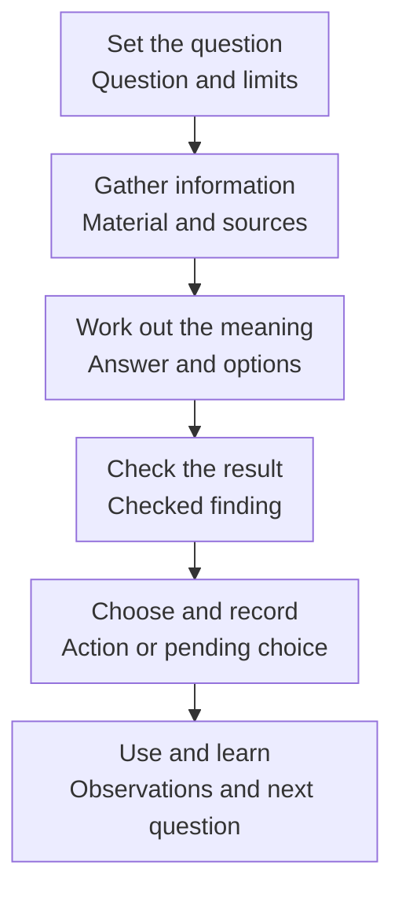
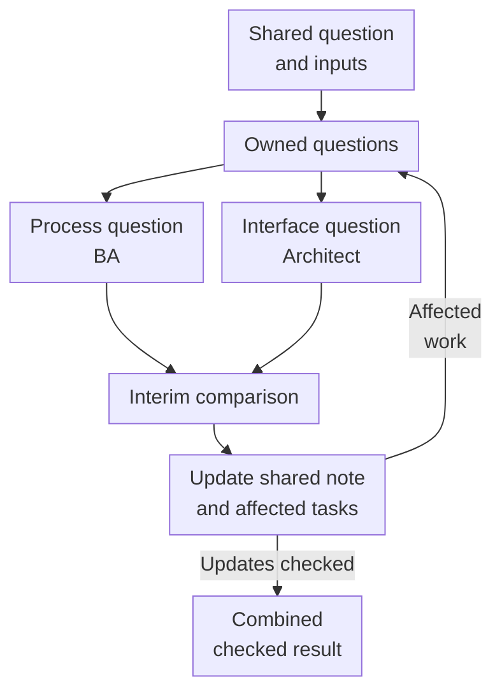

<a id="ai-assisted-research-without-losing-the-thread"></a>
# AI-assisted research in discovery

[Back to the Playbook](README.md) · [Core](core.md) · [One question](#work-through-one-research-question) · [Team coordination](#work-with-other-researchers) · [Teaching case](#worked-example)

## What this guide helps you do

Use this guide to investigate a discovery question with AI and colleagues. It is for a BA, architect, or product specialist who needs to learn something, check the answer, and put it to use. The unit of work is a research question; a prompt, conversation, or report serves that work.

The [five-part Core](core.md) identifies the decision, uncertainty, evidence, sufficient depth, and decision / stop. The six functions below explain how to conduct an inquiry within it. A broad inquiry may return an option map or a better next question. A small one may finish in one session using existing evidence.

## What a usable research result looks like

**Teaching case: request transfer.** This case is fictional throughout: its people, extracts, exchanges, choices, and proposed checks do not reconstruct the author's experience. The separately labeled **From my practice** accounts are real and anonymized.

Here is a completed working note. Its [inputs and reasoning appear below](#worked-example); it is an illustration, not a finding offered without a basis.

> **Question:** What should we test first to reduce repeated entry without sending incomplete requests into fulfillment?
>
> **Findings and grounds:** The operator's account includes obtaining missing information before submission. The interface excerpt describes active creation and required fields; it leaves draft support and retries unclear. The access note records no interface calls.
>
> **Options and recommendation:** Compare an operator-reviewed draft with a clearer manual checklist on screen. Both let us examine information collection without live writes. Unattended creation needs more answers about missing information and retries.
>
> **Open questions:** Draft/hold support, actual retry behavior, how widely the reported review work occurs, and whether either candidate reduces total operator effort.
>
> **Chosen next action:** The process owner authorizes only a synthetic, screen-only comparison. The BA prepares and reviews it. The architect investigates the documented gaps and requests authorized test access if needed. Implementation and live writes are not approved; the walkthrough has not run.
>
> **Current version:** Request-transfer inquiry, revision 2. The shared note and affected assignments no longer assume that review merely copies fields.

The recommendation and the owner's choice are separate. Without that choice, the note would name the pending decision and its owner. Use an existing task or document for this information.

## Work through one research question



Functions can combine and repeat. Return to the function needed by a particular problem, using the checks below and the [repair table](#repair-the-failure-you-actually-have). This is a route for a bounded inquiry, not six compulsory phases, chats, or people.

### Set the question (Frame)

State what must be learned, for whom, and what action or understanding it enables. Name the expected result, exclusions, available effort, and method. In the teaching case, process accounts and interface documentation support a comparison of automation options; the pass selects a next check.

Have participants restate their assignments before substantial separate work. Compare the questions, expected outputs, and dependencies; correct different assignments without requiring the same preferred answer. Keep that agreed starting point available to everyone doing dependent work.

### Gather information (Acquire)

Use documents, firsthand accounts, data, observation, or an authorized technical check according to the question. AI can locate and extract relevant passages; people obtain and interpret participant evidence. Keep the source, version, relevant passage, and conditions with the finding, plus gaps that remain.

Ask whether this method can observe what you need to know. Imagined user behavior cannot establish actual behavior. A firsthand account supports what the participant did and observed; a formal summary does not supersede it. Use existing applicable evidence when sufficient. Otherwise change the method or narrow the dependent action.

<a id="ask-where-a-repeated-pattern-came-from"></a>
### Work out what it means (Interpret)

Compare options against the question and constraints, including the current approach where relevant. Separate observations, explanations, assumptions, and choices. Return the comparison with its grounds, alternatives, limits, and open questions. AI can help organize it; check the particular inference from material to conclusion.

**From my practice.** In research I organized, a review found that requirements inherited from a shared brief and repeated across reports were being used to support common platform capabilities. The review exposed where the repetition came from: the brief itself. The lesson I took was to separate the instructions we gave from the common needs the material could actually support.

Keep imposed requirements distinct from observed demand; a legitimate design constraint need not be a market finding. Retellings and model agreement add no observations, while distinct observations in one file remain distinct. An empty field is unknown, not zero or a negative finding. An absence claim needs a method capable of detecting the event. See [Evidence](core.md#evidence).

<a id="make-critique-change-the-result"></a>
### Check the result (Challenge)

Check important conclusions against their grounds and accepted decisions. Separately check whether the recipient still has the necessary scenarios, constraints, options, and open questions. One person can perform both checks. For important objections, record the correction or why the objection remains unresolved or was rejected.

**From my practice.** In another research effort I organized, a reviewer challenged the ranking of problems, the transfer of conclusions between directions, and links between claims and sources. In the revised result, a claim became a hypothesis and the ranking became an assumption; source use and transfer limits were clarified. The critical pass changed what the team could rely on, beyond improving the prose.

Apply accepted corrections and inspect the current passage, visible diff, and affected material. If a correction removes needed content, restore it consistently with scope or agree to rescope it. For a large synthesis that loses sections, map an outline to its sources, assemble by sections, then check the whole result. If the result needs no correction, continue without inventing a defect or reviewer.

### Choose the next action and record it (Decide & record)

Present options, grounds, and consequences to the person authorized to choose. Record the chosen action or explicit pending choice, its owner, conditions, and affected work. Correcting wording within delegation need not go to management; changing scope or commitments needs the appropriate authority.

Check that the next person can tell what is permitted and what remains open. Finished analysis and silence are not approval. A working assumption can support bounded, reversible exploration when its question, owner, and review condition remain visible; it does not authorize deployment.

### Use the result and learn (Act & learn)

Perform the agreed action, or preserve the reason for a pause. Identify who will observe the result, what observation matters, and whether they have access and resources. Return what happened, what assumption changed, and the next question or review condition. The teaching case ends with this work planned: no walkthrough result or benefit has yet been observed.

<a id="split-work-when-the-separation-helps"></a>
## Work with other researchers

**From my practice.** In one discovery engagement, I ran an AI-assisted investigation while a business analyst pursued a separate research track. We started from the same materials but interpreted them differently. We did not exchange intermediate findings or reconcile those interpretations as the work progressed, and we produced two different results. Sharing the inputs had not kept the work aligned.

The coordination practices below are the response developed from discussing that experience, not a claim that we implemented them successfully in that engagement.

### Agree the assignments

Before separating, agree the common question, accepted scope, current sources, assumptions, exclusions, expected combined result, available effort, and first comparison point. Distinguish accepted decisions from proposals and older material. Each researcher states their question, result, excluded topics, and answers needed from colleagues. Compare these statements before expensive dependent work.

**Teaching case assignments:** the shared inquiry selects a next check for request transfer. Bulk processing and delivery-effort estimation are excluded. Agree the actual effort limit before starting; this illustration supplies no hours.

| Question | Human owner | Result to return | Colleague / dependency and when to share |
|---|---|---|---|
| What happens to complete and incomplete requests? | BA | Described actions, exceptions, sources, and unknowns. | Architect: first findings before developing the automation option. |
| What does the interface establish, and what needs checking? | Architect | Documented capabilities, gaps, and access conditions. | BA: when a condition changes the scenario or next check. |
| Which next check do the findings support? | Research lead with both owners | Compared options, differences, and a recommendation. | Both owners before handoff to the process owner. |

One person may own several questions. The coordinator exposes dependencies, brings people into the needed discussion, and maintains the combined result; an AI chat is not the accountable owner. Coordination does not give someone authority to settle facts.



Each track uses the first diagram. Compare initial findings before substantial dependent work and the combined result before handoff. For longer work, agree further checkpoints around dependencies. Share earlier when a finding changes the scenario, scope, method, assumption, or permission for dependent work. The [case exchange](#share-the-finding-and-update-the-work) shows what moves between colleagues.

### Share a finding

Send the finding and source, remaining uncertainty, affected work, requested response, and next step. An activity count such as “read ten sources” does not tell a colleague what needs changing.

Intentionally separate searches or critiques can protect independence. Agree their question and comparison point; do not force early sharing of tentative answers. Handle any impact on shared scope, safety, or commitments explicitly.

<a id="give-the-next-participant-current-usable-context"></a>
### Update affected work

Record the change and reason in the shared note. Identify affected questions. Their owners update their assignments, the context actually used in AI sessions or tools, and dependent conclusions. They return what changed or why their work still applies. Verify those materials: a shared folder does not synchronize conversations. Preserve independent permitted work and earlier versions.

Keep one authoritative location per current decision, with derived views where useful. An old prompt must not restore excluded scope. Share relevant original grounds with a reviewer, options and consequences with a decision owner, and current decisions and tasks with a coordinator. Neither the whole archive nor an identical summary suits everyone. Preserve contrary evidence. Working access is not permission to disclose material elsewhere.

### When results differ

Put disputed passages beside the questions and grounds they answer. Identify the difference before asking AI to combine the reports.

| What differs? | Next action |
|---|---|
| Question, scenario, terms, or scope | Agree the assignment; update affected tasks and check conclusions based on the earlier reading. |
| Sources, versions, or facts | Check exact material and conditions; give any missing check a human owner. |
| Explanation of the same observations | Keep both explanations and grounds; identify a distinguishing check or leave the difference open. |
| Recommended action | Present options and consequences to the authorized owner. Their choice does not make a disputed fact true. |

Record the correction, choice, or remaining question, its owner, and affected tasks. AI can locate differences; a smooth synthesis must not conceal them.

<a id="give-ai-a-useful-piece-of-work"></a>
## Use AI for a specific piece of the work

Assign a bounded part of the inquiry using **Question / Inputs / Work / Result / Limits**: what to learn; relevant current material and its status; the operation to perform; a usable output; and exclusions, access and effort limits. This fits in an ordinary task or message. The [filled request below](#one-interpretation-task-for-ai) uses the visible case inputs.

AI can extract, compare, propose alternatives, critique, or draft. People supply experience, interpretation, judgment, and accountability. One conversation can support exploration and critique; split for a different method, expertise, independent search, parallel work, or volume. Account for coordination and context recovery. Ordinary tools verify files, links, versions, and changes. If AI uses permitted tools, inspect the actual output; naming a tool does not show that it ran.

<a id="worked-example"></a>
## Follow one research question through the work

### Start with the shared brief

> We want to reduce repeated entry when a customer request moves from intake to fulfillment, without passing incomplete requests into fulfillment. Investigate what the operator contributes today and which approach is worth testing next: prepare a draft for operator review, create an active request without review, or keep the manual process with a clearer checklist. This pass selects a next check; it does not authorize implementation, target-system writes, or removal of required information. Bulk processing and delivery-effort estimation are out of scope.

The sufficient result is a grounded comparison and proposed next check, preserving critical unknowns. These three options fit this question; they are not a required quota. The BA investigates process cases, the architect examines documentation and gaps, and the lead compares findings with them. They do not yet know what the operator contributes.

### Gather the material

The following material arrives during the inquiry; it was not all known at the start.

**Process account — obtained by the BA from one operator:**

> On the last incomplete request, I contacted the requester to obtain the missing delivery address before submitting it. On the complete request, I checked the requested date and contact details, then submitted it. Reviewing a request is not always just copying its fields.

**Interface excerpt — read by the architect:**

> The create operation produces an active fulfillment request. Delivery address and contact information are required. The supplied extract does not describe a draft or hold operation, or behavior when the same request is resent after a timeout.

**Access note:**

> A permitted test environment is not yet available to this team. No interface calls have been made for this investigation. A screen-only walkthrough using synthetic requests is possible without sending anything to the fulfillment system.

### Share the finding and update the work

Before this exchange, the architect's tentative interpretation is: “The create operation may let us remove the transfer step.” It is neither a decision nor demonstrated feasibility.

> **BA:** The operator's last incomplete request needed a missing address before submission. Review includes collecting information, not only copying fields. Please check how the unattended option would handle that step. The account does not tell us how often this happens.
>
> **Architect:** I changed the unattended option's premise: creation alone does not cover missing-information handling. I updated my task and AI comparison context to retain that question. The documented create operation still applies; draft support and retries remain unverified.

The shared note and architect's current assignment now say: “Compare the unattended option including how missing information is obtained before submission; retain draft and retry gaps.” The earlier copying-only assumption has changed because of the process account. Check that this instruction is in the AI context actually used and that the comparison reflects it. Existing documentation work remains applicable; the BA's process work continues.

### One interpretation task for AI

Supply the brief, three extracts, and updated premise with this request:

```text
Question: Which approach should we
check next under the shared brief?
Inputs: Use the brief, process
account, interface excerpt, access
note, and updated premise above.
Work: Compare the three approaches.
For each, cite the relevant extract.
Separate reported experience,
documented behavior, and untested
behavior. Identify a next check
that could change the choice.
Result: A short comparison and
proposed next check.
Limits: No development estimate or
implementation approval. Preserve
missing-information handling and
access limits. Undocumented does
not mean impossible.
```

### Compare and check the result

A useful sample comparison is:

- **Operator-reviewed draft:** the process account supports examining information collection and correction. A screen-only check is possible under the access note; user benefit and a working draft API are unestablished.
- **Unattended creation:** the excerpt establishes active creation, not missing-information handling or safe retries. Removing review is not yet justified by that endpoint alone; this does not rule it out forever.
- **Manual process with a clearer checklist:** a comparison option for the reported review work, not a proven improvement or an automatically inferior baseline.

Review could catch the overreach “No draft API exists.” Replace it with “The supplied excerpt does not establish whether a draft operation is available.” This illustrates a possible error, not an actual model transcript. The architect's next task is to seek applicable documentation and, if necessary, authorized test access for draft/hold support and retries. Inspect the combined note and that task to verify the correction survived.

Also check that one operator's two instances have not become a prevalence estimate or permission to change the process. Documentation is not tested behavior. If the comparison already respects these limits, keep the checked result without manufacturing an edit.

### Record the choice and hand it on

Recommend the screen-only comparison because it can examine review and information collection without the unavailable interface environment. It cannot establish integration feasibility or operational savings. The fictional process owner then chooses that bounded action, as recorded in the [completed note](#what-a-usable-research-result-looks-like). If the choice were pending, identify who must answer and which dependent work waits.

The BA receives the complete/incomplete scenarios and selected question; the architect receives exact technical gaps and access limits; the owner receives options and consequences. Use views of the shared note rather than three new documents.

For the planned walkthrough, the BA will examine whether an operator spots missing information, requests correction, and understands what will be sent. Record mistakes, extra review effort, and participant actions. The case stops before that walkthrough runs. A later claim of reduced workload would need operational observations under comparable conditions.

<a id="repair-the-failure-you-actually-have"></a>
## Check the result and decide what to do next

| Inspect | If the check fails |
|---|---|
| Important conclusion, source, and conditions | Revisit the particular inference or obtain missing information. A longer prompt cannot supply absent data. |
| Intended next action and blocking conditions | Change method, assign a permitted check, narrow the action, or pause its dependent part. |
| Recipient's scenarios, constraints, and open questions | Restore needed coverage or explicitly agree a changed scope. |
| Current correction and affected materials | Compare versions, apply or repair the change, and inspect the result. “Noted,” “Final,” or a tracker status is insufficient. |
| File, link, or format | Use an ordinary file, link, diff, or format check; verify the repair rather than adding an analytical reviewer. |
| Owners' changed assignments and AI contexts | Check who handled the shared finding; resolve the specific difference and update affected work. |
| Pending choice or changed commitment | Bring options and consequences to the authorized owner; a reviewer cannot supply that authority. |

<a id="finish-useful-work-then-follow-through"></a>
### Check the cost and follow through

Choose measures for three different purposes. For the **question**, observe relevant behavior or technical conditions. For the **work**, record actual effort, waiting, coordination, context recovery, and rework against the agreed limit. For the **action**, compare later observed effects with the intended outcome and review condition. Missing cost data stays missing; planned effort is not actual effort or a saving.

At the effort limit, use the result, narrow the question, change method, agree bounded continuation, or stop. Exhaustion does not prove readiness. A synthesis, explanation, or restoration can justify further bounded work without new observations. Confirming the original plan can be useful. Source counts, chats, meetings, model agreement, and archive size do not establish value.

A serious one-off failure can justify a targeted safeguard. Evaluate whether it improves findings, decisions, corrections, rework, or people's load. Keep [sufficient depth](core.md#sufficient-depth) and [decision / stop](core.md#decision-stop) explicit. A finite engagement can end under agreed criteria; continuing observation needs an accepting recipient with access and resources. A name alone does not create that capacity. [Client AI use in acceptance](patterns/outsourcing-presales.md#ai-mediated-review) is a separate commitment question.
