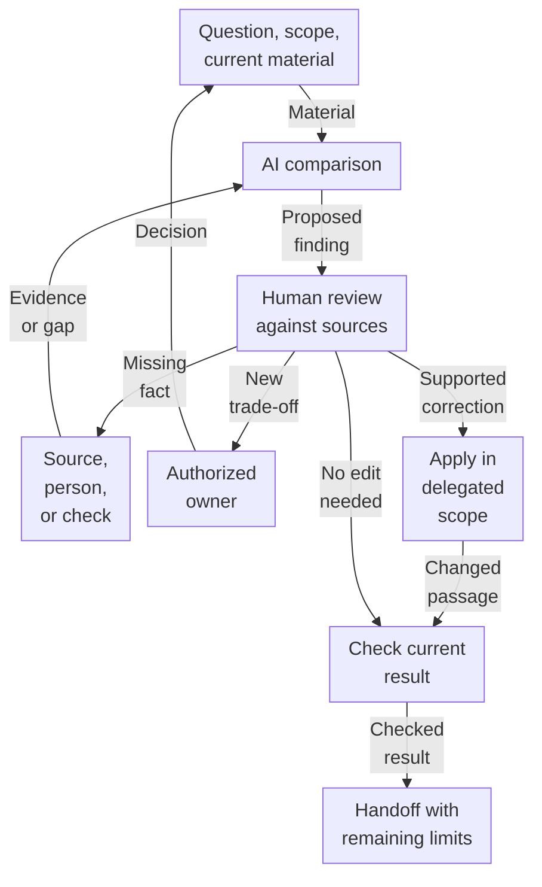

# AI-assisted research without losing the thread

[Back to the Playbook](README.md) · [Core](core.md)

Use this optional companion to prepare a useful AI request, inspect its result, and pass the work on. The [five-part Core](core.md) still applies. Start with the example, then use the guidance relevant to your question.

<a id="worked-example"></a>
## Worked example: check a draft before estimation

**Hypothetical teaching example.** The extracts, sample response, correction, and next actions below are invented illustrations, not an actual model transcript or completed client experiment.

You are checking a revised first-phase integration description for engineering estimation. You may restore wording to the agreed scope; changing that scope needs its authorized owner. The task is to produce a usable description and identify the next technical question, not authorize launch.

### Inputs

**Agreed scope**

> In the first phase, an operator reviews each individual request and confirms its transfer from one system to the other. Bulk transfer is outside this phase.

**Current technical note**

> The receiving interface's retry behavior has not been checked. We do not yet know whether resending a request can create a duplicate. No result from a technical probe is available.

**Revised draft under review**

> Requests are transferred automatically between the systems. Retries cannot create duplicate requests.

The scope records a choice, not technical feasibility. A newer draft has no authority to change it without an authorized decision.

### Request to AI

```text
Use the three labeled extracts.
Check the draft before estimation.
Find lost scope or conditions and
unsupported technical claims.
For each issue, show the passage
and its basis in the inputs.
Propose a correction or a question.
Separate permitted corrections
from choices for the scope owner.
Check correctness and coverage.
Do not invent missing behavior
or results from tests not run.
The draft is not a scope decision.
```

When adapting this request, supply your corresponding extracts. It assumes only the visible material, not access to an unseen repository or earlier chat.

### Sample useful response

This is an illustrative response, not a guarantee of what a model will return:

- **Lost operator confirmation.** “Requests are transferred automatically” omits the scope's operator review and confirmation. Restore them within the analyst's stated delegation.
- **Missing scope boundary.** The scope excludes bulk transfer; the draft omits that exclusion. Preserve it. This is not evidence that the draft explicitly requested bulk functionality.
- **Unsupported guarantee.** “Retries cannot create duplicate requests” conflicts with the technical note's stated uncertainty. Remove the guarantee, retain the retry question, and identify an appropriate technical check.

If the draft already preserves these conditions and the uncertainty, a useful response is “No material discrepancy found against these inputs.” Do not manufacture an edit or another reviewer.

### Correct, verify, and hand off

**Proposed corrected passage — still part of the hypothetical example:**

> In the first phase, the operator reviews each request and confirms its transfer. Bulk transfer remains outside this phase. Retry behavior is unverified; whether resending can create a duplicate remains an open technical question.

Compare that passage with the scope and technical note. Apply only the permitted correction, then inspect the current file or visible diff: are operator confirmation, the bulk exclusion, and the retry question all present? If the file still contains the original text, the correction is unapplied, whatever the model says. Carry the unresolved condition into the estimate and relevant diagram.

**Filled-in handoff for this example:**

- **To the engineer:** Examine applicable interface documentation and existing results for duplicate behavior on retry. If they answer the question, return the evidence and its conditions. Otherwise, propose a bounded check in an authorized environment. If no suitable check is available, leave the question open and limit the dependent claim. This request authorizes neither production traffic nor a claim that a test has run.
- **To the scope owner, only if change is proposed:** Removing operator confirmation or adding bulk transfer changes the accepted phase. Present the proposed scope, consequences, and choice needed. Restoring agreed wording within delegation needs no extra management approval.

The editorial task can finish with this corrected description and a specific open question. It need not produce a successful probe or a closed integration risk. A proposed edit becomes a completed correction only after the changed result is checked.

### How the interaction works



These are interactions for the example, not required stages or separate jobs. One person can perform several functions. Human review cannot turn a missing fact into evidence: use an appropriate source, participant, or permitted check. AI may use permitted tools; the source or actual result supports the finding. A checked handoff can retain an open condition and does not authorize implementation or launch.

## Give AI a useful piece of work

Adapt the [worked request](#worked-example) to the question, intended use, current inputs, constraints, and effort limit. AI can inspect sources, generate questions and alternatives, compare versions, draft, critique, or synthesize. Choose the useful function; do not run them all by default. Existing applicable evidence may make another pass unnecessary.

Keep relevant passages and conditions accessible. A firsthand account supports what the participant did and observed; a formal-looking summary does not supersede it. Questions about actual behavior still need suitable participant evidence or external checks, not a more detailed imagined account.

## Split work when the separation helps

One conversation can support exploration and critique. Separate work for another method, search, expertise, parallel task, or volume, with someone responsible for coordination and assembly. A separate chat or persona is not independent evidence, and model agreement is not a vote on truth. Use the second perspective to find omissions or challenge a claim; account for the cost of reconstructing context.

## Ask where a repeated pattern came from

**From my practice.** In research I organized, a review found that requirements inherited from a shared brief and repeated across reports were being used to support common platform capabilities. The review exposed where the repetition came from: the brief itself. The lesson I took was to separate the instructions we gave from the common needs the material could actually support.

**Separate fictional illustration:**

- **Instruction given to every report:** “Describe a central review capability for each context.”
- **Reports:** Two reports each contain a central-review section.
- **Before — unsupported conclusion:** “Both contexts independently demand central review.”
- **Check:** Compare the shared instruction with those sections and the relevant observations, if available.
- **After — supported conclusion:** “Central review was required by the brief. Repeated sections alone do not establish independent demand.”

The capability may be an intentional design constraint. Use existing observations if they support demand; if they are missing, leave that claim open rather than declaring demand absent. Retellings add no observations, while distinct observations in one file remain distinct. Preserve context and unknowns in comparisons: an empty field is not a negative finding. See [Evidence](core.md#evidence).

## Make critique change the result

**From my practice.** In another research effort I organized, a reviewer challenged the ranking of problems, the transfer of conclusions between directions, and links between claims and sources. In the revised result, a claim became a hypothesis and the ranking became an assumption; source use and transfer limits were clarified. The critical pass changed what the team could rely on, beyond improving the prose.

The [fictional correction above](#worked-example) shows how to use this lesson: compare the proposal with its basis, inspect the applied change, and preserve coverage and unresolved conditions downstream. Correctness and sufficient coverage are distinct checks, not separate required reviewers. “Noted,” a proposed patch, tracker status, or “Final” in a filename is not the changed result.

If a large synthesis loses content, map the needed sections to their sources, assemble by sections, then check the whole result. This is a remedy for lost coverage, not a pipeline for every short task.

## Give the next participant current, usable context

Pass the chosen scope, exclusions, assumptions, open questions, actual version, and requested next action. An old architecture prompt must not silently restore excluded features. A working assumption can support bounded, reversible exploration when its open question, owner, and review condition remain visible; it does not authorize deployment.

Keep one authoritative location per current decision, with clearly derived views as needed. Preserve history and update affected materials. Tailor access: a reviewer needs original grounds and conditions; a decision owner needs options and consequences; a coordinator needs current decisions and next work. Neither the full archive nor one identical summary suits everyone. Brevity must not hide contrary evidence.

Working access is not permission to disclose material elsewhere. Respect the recipient and disclosure boundaries. Handoff supports shared understanding and does not replace participation. [Client use of AI in acceptance](patterns/outsourcing-presales.md#ai-mediated-review) remains a separate situation with its own commitment boundaries.

## Repair the failure you actually have

| What is wrong? | Useful response |
|---|---|
| Meaning or evidence | Revisit the claim, its basis, conditions, and competing interpretations; review the corrected result. |
| Missing external information | Obtain suitable data, participant input, or a permitted test; otherwise narrow or defer the dependent action. |
| An unmade choice | Present the options and consequences to the authorized owner; identify who must answer. |
| Outdated state | Check the current version and accepted decisions, compare changes, and update the affected materials. |
| A file, link, or format problem | Use ordinary file, diff, link, or schema checks to identify the defect and verify its repair. |

AI may use permitted tools, but inspect the output rather than relying on “updated.” Adding a reviewer does not substitute for repairing a broken file; a larger prompt cannot replace absent external data. Match the repair to the failure before adding a standing procedure.

## Finish useful work, then follow through

A pass can reveal a relationship, test an objection, improve an explanation, restore coverage, or prepare a handoff without adding observations. Name the purpose and effort limit. Rephrasing is useful when editing is the task; synthesis creates understanding, not automatically independent evidence. The [sufficient-depth question](core.md#sufficient-depth) allows this work.

Finish with what was established, what remains assumed, and the action chosen or awaiting a decision. Preserve who acts, who observes later results, and when to revisit under [Decision / stop](core.md#decision-stop). An agreed engagement can close without unlimited follow-up. Judge the organization by useful findings, decisions, checked corrections, rework, and load on people—not archive size.
