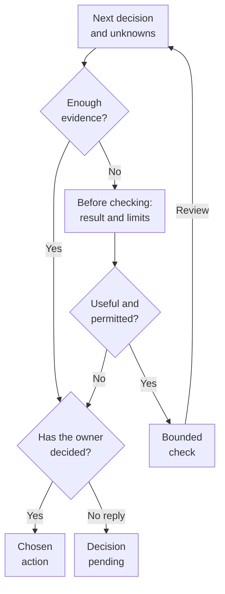

# Core — from a question to the next action

[Back to the Playbook](README.md)

> **Discovery helps establish a sufficient basis for the next consequential action—or a reasoned decision not to take it.**

The Core has five elements: **decision, uncertainty, evidence, sufficient depth, decision / stop**.

The Core is a shared reasoning discipline for all three contexts in the playbook.

A small, reversible change may need only a 20-minute conversation: choose the change, check it against existing data, and define how to check the result and when to roll back. For a larger decision, the same Core helps identify questions that need a separate investigation. Neither scale is the default for other tasks.

The first **decision** means “what choice are we preparing to make?” The final **decision / stop** means “what have we chosen, and what do we do now?”

The rules draw on the author's firsthand practice and [selected external ideas](README.md#foundations-and-development); the explicitly hypothetical example below illustrates their use rather than reconstructing a particular engagement. The Core does not prescribe team composition, interview counts, a document set, or the duration of discovery.

## Map of the next action

This is a map for choosing the next action, not mandatory discovery stages. New information may change the original question; the restriction applies to dependent work, not automatically to the whole project. At review, compare the result and its limits with the decision and cost limit. Another check requires a new justification and available resources under the [Sufficient depth](#sufficient-depth) rule; exhausting the budget does not establish readiness. Sufficient current evidence allows you to skip new research. The owner may continue, narrow, change, defer, or stop the action, including before every question is closed. Completed analysis with a decision still pending does not authorize dependent implementation—see [Decision / stop](#decision-stop).

## 1. Decision — define the choice to be made

### Purpose

Give the investigation a specific purpose. “Understand the product,” “prepare a BRD,” and “analyze the architecture” describe activities or materials. They do not yet explain what choice the work will make possible.

The initial question does not require knowing the right answer in advance. It defines the problem worth seeking an answer to. At an early stage, the choice may even be “which problem should we investigate first?” rather than “which system should we build?”

### Failure it prevents

The team starts collecting material, but people expect different results: one wants a development estimate, another a check of a technical idea, and a third a search for the product's first use case. Everyone is busy, yet the work does not converge on a shared decision.

These tasks can be combined. But one must not silently replace another: architectural analysis, testing a product hypothesis, and defining the initial scope prepare different decisions.

### Minimum rule

> **Before incurring material costs, name the next decision, its connection to a business or user outcome, and the person authorized to make it.**

For example, instead of “audit the platform”:

> Decide which parts of the existing system can support the first client use case and what must be built from scratch.

Explain whose situation should improve, what change would matter to them and the business, and why the action could produce it. Name an available signal that could inform that belief and what must not get worse. Delivering a capability is an **output**; using it is a **local signal**; the intended benefit is an **outcome**. Neither delivery nor usage alone proves that benefit. The connection between action and effect remains something to examine.

You do not have to list every option immediately. It is enough to identify which action cannot yet be justified, why it matters now, and when an answer is needed. “Prove that our option is best” replaces investigation with a defense of a decision already made.

### When it is enough

Participants share an understanding of the decision being prepared, why it is needed, and who will use the result. A complete product vision for the next several years is not required.

If the path to an outcome is unclear, agree on a bounded learning goal, such as finding an initial use case, instead of inventing a performance target. A technical or operational benefit can be appropriate to the decision; a small change does not require a metric hierarchy, numeric baseline, or market-demand study.

**Checking question:** “What will we be able to decide or do after this work that we cannot currently justify?”

## 2. Uncertainty — identify unknowns that actually affect the decision

### Purpose

Separate material uncertainty from a general lack of knowledge about the product. An architect does not need to learn everything about the company before checking one integration. But conditions that could invalidate the chosen approach or materially change its cost must not remain hidden.

### Failure it prevents

An assumption about a component's readiness, API behavior, or resource availability becomes the basis for architecture and an estimate. Its uncertainty is lost during handoff, and investigation is deferred to implementation.

For example, a repository's existence does not by itself establish whether a solution suits a new use case. Not everything needs to be checked in advance; identify the assumptions the next action depends on.

### Minimum rule

> **Prioritize unknowns that could change the next decision, and explain the consequences of a wrong assumption.**

For example:

> We plan to automate CRM setup, but have not yet confirmed that the available permissions and APIs allow the required operations. If they do not, the use case and scope will change.

This is more specific than “there are integration risks”: it shows exactly what is unknown and why it matters.

For a consequential choice that remains open, compare meaningfully different ways to meet the same understood need or intended effect. A process change, narrower integration, or retaining the current approach may be viable alternatives if they fit the constraints. Identify what must hold for each to help; a shared assumption may allow one check to inform several options. There is no fixed quota of alternatives or assumptions, and no need to invent weak options or reopen a justified routine change.

Priority depends on the consequences of an error, whether the action can be reversed, and the cost of checking. Consider probability when there is a basis for it; percentages and scores are not needed just for presentation.

Distinguish an **unknown fact** from a **decision not yet made**. “Is the operation supported?” calls for a check. “Do we include Web in the first phase?” may call for a product and budget decision. More research does not replace the authority to choose scope.

An **accepted assumption** is an unconfirmed condition that someone has chosen to rely on within defined limits. A **known risk** is a possible adverse event with understood consequences; it can be considered even when the underlying facts are known. Neither should be marked as closed merely because it was discussed.

For example, dependence on a single specialist may be established, but further research will not by itself remove it. For a material risk, identify what could happen, whom or what it would affect, what response is needed, and who will organize the next step.

### When it is enough

It is clear which questions are being checked now, which go to the decision owner, and which do not affect the next step and remain outside its scope. For a material gap, there is a clear way to get an answer or a person who can help arrange it.

A complete catalog of company risks is not required: for a small piece of work, keeping material risks in the existing task is enough; a separate register remains optional. Finding a risk does not automatically make someone responsible for all its consequences.

If an established condition is sufficient to reject the current option, the remaining planned checks do not necessarily need to continue.

**Checking question:** “How would our plan change if this assumption were wrong?”

## 3. Evidence — establish a basis that fits this question

### Purpose

Make the quality of a finding depend on what was actually established, rather than the length of a report or how persuasive an explanation sounds.

Here, evidence means a basis that can be checked: an observation, document, data, experimental result, or confirmation by an authorized participant, depending on the question. It does not require personally repeating a check of the primary source in every case.

### Failure it prevents

One kind of information is presented as the answer to a different question. A general user need is treated as agreement with a particular way of meeting it. A working integration is treated as product demand. Agreement on a document is treated as confirmation of every technical assumption in it.

For example, “users care about security” and “users are willing to complete this extra registration step” are different claims. Checking the first does not settle the second.

### Minimum rule

> **Use an appropriate way to check a material claim, and preserve the limits of the resulting finding.**

**Participation depends on the question, the way it will be checked, and the skills required.** Distinguish the person who knows the situation, the person who can carry out and interpret the check, and the person authorized to choose an action. These need not be three people. The functions of leading, reviewing, and deciding do not replace subject-matter competence.

**How to obtain evidence and whom to involve**

| Question | How to obtain evidence | Required competence / participant | What this does not establish |
|---|---|---|---|
| How is an operation carried out across departments? | A concrete case with the person doing the work, records, and process data | Someone who knows the process; a BA to analyze it | The full process beyond the case examined |
| Does a technical operation work under the required conditions? | Applicable documentation; a permitted test if a gap remains | An engineer / architect familiar with the system | Other environments and scales; market value |
| Is a new user step acceptable? | Test a specific flow with the target audience | User research skills and members of the audience | Sustained demand from a single expression of interest |
| Is there an initial use case and demand? | Real cases and a test of the offer with the audience | A product analyst or product specialist with market and user research skills | Demand beyond the audience tested |
| Can material data, security, and operational conditions be met? | Applicable requirements, data, and a permitted check | The relevant specialist | Permission to skip a mandatory condition |
| Is a capability included in the phase and budget? | An explicit decision and agreed scope | The owner of the budget and relevant commitments | The truth of a technical or market claim |

The table connects a question, evidence, and competence; it is not a staffing plan. An expert in the method does not replace the audience or the person doing the work as a source of information. Existing current and applicable evidence may be enough; one check does not automatically establish what holds under other conditions.

A job title does not guarantee competence: experience with product telemetry is not the same as experience researching a new market. A BA or architect may have the required skills; expert opinion still does not replace evidence from the audience about its behavior.

A practical default is a small team combining relevant skills, with specialists involved while they can still change the question, options, or interpretation. Product, design, engineering, research, and domain perspectives matter where the question needs them, not only at final review. For one actual scenario, compare participants' understanding, identify any differences, and choose the next check if needed. Individual preparation, asynchronous input, and a focused discussion can coexist; this is not a required workshop or attendance list. Account for availability and interpretation time. If a skill is missing, narrow the finding, bring in help, or defer dependent work; more AI-generated text does not fill that gap.

Choose the smallest **meaningful and admissible** check of the material assumption, rather than automatically building an MVP or choosing the cheapest artifact. Before testing, agree what behavior or system result would support or challenge the assumption, under which conditions, and how it could change the choice. A result may be inconclusive or reveal a flawed test; consider plausible competing interpretations. Do not silently move the threshold to rescue a preferred idea. Existing applicable evidence may make another test unnecessary.

Distinguish observation, interpretation, and an accepted assumption. A recommendation proposes an action on that basis; a decision records the choice of an authorized participant.

The weight of a source depends on the question, proximity to the event, coverage, and corroboration. A firsthand account is primary evidence of what the person did and observed. A document lets you check its text and version, but the existence of a requirement does not establish that it was communicated, understood in the same way, or agreed. Neither a personal account nor a retrospective compiled from other material establishes, by itself, other people's motives, universal causes, or the effect of the rules. Check discrepancies against timing, subject matter, and the observer's perspective; preserve unresolved differences. Repeating an account in several AI syntheses does not create independent corroboration.

### When it is enough

You can explain what has been established, on what basis, under which conditions, and what remains unchecked. The result lets you compare options, rule one out, or acknowledge that the chosen check did not answer the question.

**“Not confirmed” does not automatically mean “disproved.”** Nor does the absence of disproof confirm a hypothesis. A failed small test does not reject an entire customer need; a positive one does not establish a population-wide rate or satisfy an unmet mandatory safety condition.

**Checking question:** “Does this evidence answer our question, or does it merely look related?”

## 4. Sufficient depth — limit the check to what the decision needs

### Purpose

Avoid acting before enough has been checked, or continuing research after its additional value no longer justifies the cost.

Sufficient depth relates to a specific next action. There may be enough evidence for a limited pilot but not yet for a broad rollout. Choosing a pilot does not confirm the entire future product.

### Failure it prevents

Two opposite mistakes:

> The budget is exhausted, so everything has been checked.

> Questions remain, so we continue without a limit.

The same time allowance does not justify promising the same result for different tasks. New questions do not by themselves justify continued spending.

### Minimum rule

> **Before a material check, name the next decision, the basis sufficient for it, excluded questions, the cost limit, and the condition for review.**

Choose depth based on the severity and reach of the consequences, whether the action can be reversed, and the affordable cost of checking. The cost limit accounts for effort, elapsed waiting time, and the effect of delay on the next step. These are different things: waiting for access must not look like active analytical work, but it can still change the schedule and the decision.

Risks of the future decision—such as an unsuitable integration or a new step users find unacceptable—differ from the risks of running discovery. Evidence may become outdated before the decision; delays and cost overruns in the investigation itself also need a response.

When new information arrives, the criterion can be revised explicitly, with an explanation, rather than silently moved until the desired answer appears.

Before doing more work, it helps to ask: “What possible result of this check would change our decision?” If such a result is possible but the method cannot produce it, change the method. If the answer would not affect the action, defer the research.

**How to choose a response to risk**

| Situation | Possible response | Boundary for the next action |
|---|---|---|
| A material fact can be checked by a permitted method within a justified limit | A bounded check | Define a sufficient result, costs, and review conditions before starting |
| Research will not remove the danger or is unjustifiably expensive | Change / limit the action, arrange a technical safeguard, or decline to act | More analysis is not mandatory just to keep work going |
| A mandatory condition for safe action has not been met | Limit or pause the dependent part | Accepting risk does not waive the condition; permitted independent work continues |
| Discovery is delayed by access, a participant, revisions, overruns, or a pending decision | Assign responsibility for the next step; revisit scope, method, or schedule | Waiting does not count as a completed check; silence does not authorize dependent action |
| Sufficient current evidence for a permitted action already exists | Choose an action without repeating the research | Normal checks of the result and review conditions still apply |

These are possible responses, not an algorithm with one answer per row. Risk can exist even when the facts are known; severe consequences do not always call for more research. For a remaining material risk, explicitly identify who is responsible for the agreed action and when to review it; the person who found the risk does not automatically take on all its consequences. Decisions remain within the person's authority, as described in [Decision / stop](#decision-stop).

### When it is enough

There is a basis for a bounded decision, or it is sufficiently clear why further checking is not worthwhile or possible now. Remaining unknowns are identified rather than presented as closed.

Exhausting the budget is a reason to choose the next step: narrow the task, agree on another check, wait for an external condition, or stop pursuing the direction. It is not evidence of readiness or automatic permission to keep spending.

Keeping discovery minimal does not permit bypassing mandatory safety requirements or compliance with applicable rules. If compliance cannot be checked, limit or defer the dependent action; independent work need not stop.

**Checking question:** “What exactly is missing for the next step, and is getting that answer worth the additional cost and wait?”

## 5. Decision / stop — close the question with an explicit next action

### Purpose

Ensure that the investigation changes or confirms the team's actual actions, rather than remaining only in the researcher's materials.

This is not an obligation to obtain approval for development at any cost. A reasoned decision not to proceed, a narrower use case, or an explicitly pending decision are valid outcomes.

### Failure it prevents

The author knows the finding, but the BRD, mockups, architecture, and estimate still describe different options. Or the analysis is complete, yet nobody has decided, and silence is treated as permission to continue.

“The document is ready” does not yet explain which action is now agreed or which conditions still apply.

### Minimum rule

> **Close the question under investigation with an explicit outcome: what happens next, on what basis, within what boundaries, and who makes that choice.**

The outcome may be to continue with explicit residual risk within the decision owner's authority, change or limit the action, arrange safeguards, run another justified bounded check, wait for an external condition, or decline to proceed. These are decision options, not mandatory statuses for an information system.

Accepting risk does not turn an assumption into a fact or waive mandatory conditions for safe action. For a remaining material risk, the consequences, the person responsible for the agreed action, and the condition for revisiting it must be clear. A lack of response does not mean that risk has been accepted.

Record material decisions where the team actually looks for its tasks and commitments. If a decision changes scope or an assumption behind the estimate, the relevant materials must change. A known contradiction must not silently pass into requirements, an estimate, or implementation. Hand over the chosen option, its limits, and relevant assumptions, without copying the entire research archive.

### When it is enough

People whose work depends on the decision share an understanding of the next step, its boundaries, and the remaining conditions. Identify who is responsible for carrying out the action. For a consequential choice, also identify who will observe later results, which observation matters to the intended effect, and when or under what conditions to reconsider. Existing tasks, telemetry, operating reviews, or customer contact can support this; a new register is unnecessary. Closing this question does not establish later impact or end an ongoing product team's customer learning. A finite engagement can still finish under its agreed criteria; any gap in responsibility or resources for follow-through must remain visible.

**Analysis may be complete while a management decision is still pending.** Keep those states separate. A lack of response does not mean agreement, nor does it oblige the person doing the work to keep adding to the materials indefinitely. If a decision is pending, identify who needs to answer by when, who will escalate a delay, and which dependent work is not yet authorized.

Choosing the original option is also a result: discovery does not have to overturn the initial plan to be useful.

**Checking question:** “What happens differently now—or on what basis do we continue with the original plan?”

## One example through the Core

**A hypothetical example, not a reconstruction of an experiment that took place.** A company is considering automating the transfer of a request between two systems.

**Decision.** Choose the first use case: automatic transfer or a limited process involving an operator.

**Uncertainty.** The availability of the required data and the ability to retry safely after a failure have not been established. Questions about a future platform beyond this use case do not yet affect the decision.

**Evidence.** Walk through a real request with the operator, compare the fields, and check material integration conditions in a permitted way. Do not substitute a general CRM demonstration for this work.

**Sufficient depth.** Check the inputs, operation result, and material exceptions in the first use case. Do not design every future connector. Define the limits of the check and what a limited pilot will require in advance.

**Decision / stop.** Use the result to choose a permitted option or stop the dependent part. Record the evidence and boundaries. This example does not assume in advance that the check will succeed.

If the necessary information already exists, is current, and applies to the situation, the same decision can be made without a separate research project.

## Where the Core ends

The Core poses questions about the work. It does not prescribe a sequence of meetings, participants' job titles, or a universal research duration. Differences in application are covered in the three context patterns: [startup](patterns/startup.md), [product company](patterns/product-company.md), and [outsourcing / presales](patterns/outsourcing-presales.md).

When several initiatives compete for shared constrained capacity, [flow control with DBR](patterns/outsourcing-presales.md#flow-control) may also help. This mechanism does not become a sixth Core step.

Results from applying the playbook should feed back into the relevant rule as specific changes. Not every small question needs a separate retrospective meeting. Add a rule or tool to address a particular problem, not simply to expand the playbook.

---

[Back to the Playbook](README.md)
