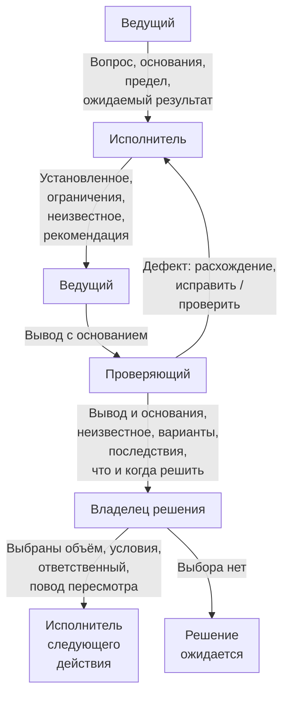
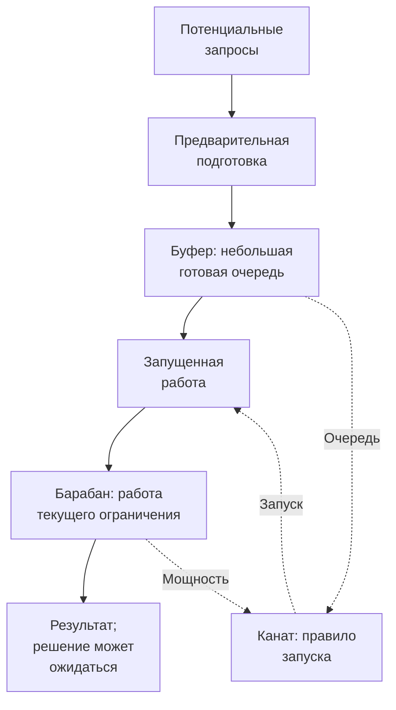

# Аутсорс / пресейл — от запроса к обоснованным обязательствам

[К началу Playbook](../README.md) · [Core](../core.md)

В пресейле discovery помогает определить, что команда может обоснованно предложить клиенту, на каких условиях и что ещё предстоит выяснить. Ближайший выбор может быть небольшим: брать ли запрос в работу, оценивать ли выбранный сценарий, проверять ли интеграцию или сначала уточнить задачу с клиентом.

Здесь [Core](../core.md) дополняется правилами передачи контекста, проверки результата и принятия обязательств. Для знакомого изменения иногда достаточно короткого разговора. Отдельный проект discovery нужен по содержанию неизвестного, а не по факту появления новой сделки.

## Квалификация до назначения бюджета

Запрос «заменить CRM» или «переписать на другой технологии» задаёт желаемое действие, но сам по себе не устанавливает причину проблемы. Если причина способна изменить объём или архитектуру, сначала получите достаточно фактов о реальной работе для ближайшего выбора: например, разберите, где теряется заявка и что этому предшествует. Предложенное клиентом решение сохраняется как вариант или обязательное ограничение; полная реализация не должна быть первым обязательным способом проверить его необходимость.

Если клиент уже провёл достаточную диагностику или обоснованно закрепил обязательное решение, проверьте применимость этих оснований и работайте в согласованных границах. Это не повод навязывать аудит всей компании или заново запускать discovery из-за несогласия архитектора.

До обещания одинакового пакета всем клиентам разберите, на что фактически уйдёт работа:

- **Знакомая адаптация:** есть применимый опыт; нужно проверить отличия, ограничения и объём изменений.
- **Согласование людей и процесса:** сведения существуют, но разнесены между участниками, противоречат друг другу или требуют решения клиента.
- **Исследование:** неизвестны проблема, первый сценарий или приемлемость решения для аудитории; нужны подходящие внешние свидетельства.
- **Техническая неопределённость:** предстоит проверить существенную возможность, совместимость, доступность данных или пригодность существующего компонента.
- **Сочетание этих работ:** например, интервью определяет сценарий, после чего техническая проба проверяет его реализуемость.

Это ориентиры для разговора, а не обязательная классификация. Один запрос может менять характер по мере выяснения. До назначения бюджета полезно назвать ближайшее решение, ожидаемый способ проверки и существенные зависимости. Если пока непонятно даже это, сначала ограничьте усилие на уточнение запроса.

Уточните и приобретаемый результат: описание объёма, архитектурная проработка, проверка гипотезы или их оговорённое сочетание. Готовая архитектура не доказывает спрос; согласованное описание продукта не подтверждает работоспособность интеграции. До обещания пакета определите нужные [компетенции](../core.md#evidence), доступность участников и стоимость их участия: поиск рыночного применения может потребовать иных навыков, чем техническая оценка.

## Передача из продаж

Команде нужен контекст, который влияет на решение и обещания. Его можно передать в существующей карточке сделки или коротком разговоре с записью существенного:

- почему клиент пришёл сейчас и какой результат ему нужен;
- что уже обещано, а что обсуждается как возможность;
- известные ограничения бюджета и сроков;
- кто принимает решения со стороны клиента и исполнителя;
- кто знает предметную область, какие люди, материалы и доступы доступны;
- известные зависимости, противоречия и условия, на которых строилось предложение.

Доступ ко всей истории продаж и не относящимся к задаче коммерческим данным не требуется. Неизвестное отмечают явно: отсутствие сведений о бюджете не означает его неограниченность, а обсуждение функции не означает обязательство её поставить.

Перед началом зависимой проверки убедитесь, что нужный специалист или доступ действительно доступны либо есть согласованный способ их получить. Если нет, зафиксируйте владельца зависимости и срок следующего решения. Безопасную независимую работу можно продолжать; ожидание ответа следует показывать отдельно от трудозатрат.

## Кто ведёт, кто проверяет, кто решает

Подготовка вывода, содержательная проверка и выбор действия — разные функции. Ведущий discovery удерживает ближайший вопрос, организует получение свидетельств, собирает результат и поднимает препятствия. Распределение функций не заменяет предметную компетенцию для проверки.

### Что передавать между участниками

Это условный маршрут для вопроса с несколькими участниками, а не четыре обязательных человека или отдела. Простой вопрос может его обойти. Следующим действием может быть и пауза или отказ; получателем будет тот, кому поручена следующая работа. Завершённый анализ не означает принятого решения, молчание не означает согласия. Пока решение ожидается, зависимая реализация не разрешена; допустимая независимая работа продолжается.

Получатель должен понимать порученную проверку. **Делегирование проверки не передаёт полномочий на бюджет, объём или принятие остаточного риска.** Исправление фактической ошибки требует подходящих свидетельств; управленческая эскалация — выбора действия. Руководитель может оплатить проверку или выбрать обходной вариант, но не объявить неподтверждённую возможность API существующей. Вывод с известным противоречием нельзя переносить в оценку как подтверждённый.

### Кто готовит, проверяет и выбирает действие

| Вопрос или результат | Кто готовит | Кто проверяет по существу | Кто вправе выбрать следующее действие |
|---|---|---|---|
| Как проходит клиентский процесс | Исполнитель проверки с участниками процесса | Компетентный участник, знающий процесс | Владелец затронутого процесса и обязательств |
| Технический вывод и вариант | Инженер или архитектор | Специалист нужной области | Уполномоченный владелец технического выбора |
| Первый этап или изменение сроков | Ведущий с предметными специалистами | Участники, проверяющие объём и зависимости | Владельцы затронутых обязательств клиента и исполнителя |
| Реакция на существенный риск | Обнаруживший риск с профильным участником | Специалист по соответствующему вопросу | Владелец решения в пределах своих полномочий |
| Передача результата дальше | Ведущий с авторами результата | Компетентные участники: согласованность всего пакета | Владелец следующего действия в согласованных границах |

Это пример назначения функций, не должностная инструкция. Функции могут совмещаться, если характер работы это допускает; отдельная независимая проверка нужна там, где она действительно требуется. Обнаруживший риск не становится владельцем всех последствий. У клиента и исполнителя могут быть разные владельцы обязательств: внутреннее решение одной стороны не меняет обязательства другой автоматически.

Техническое review, включая разрешённое автоматическое, не даёт права менять объём или бюджет. Перед отправкой клиенту полезно проверить пакет целиком: описание, схема, макет и оценка должны выражать одно решение с одинаковыми ограничениями.

## Фиксированное усилие и граница результата

**Лимит усилий — это сколько готовы потратить на вопрос. Гарантированный результат — отдельное обязательство.** Одно не следует из другого.

Например, выделенные 20–25 часов могут быть границей доступной мощности, но не обещанием получить одинаково точную оценку по любому запросу. Это условный пример, не норматив. До начала нужно договориться, что проверяем, какой результат работы передаём и какого основания достаточно для следующего действия.

Если в этот предел входит техническая проба, можно согласовать отчёт о проверенных условиях и ограничениях. Нельзя из одного лимита вывести обещание, что нужная возможность обязательно подтвердится. Критерии приёмки оплаченной работы согласуют явно; получение следующей сделки или запуск продукта не подменяют их задним числом.

На границе усилия рассмотрите полученные основания. Возможны оценка в подтверждённом объёме, более узкий вариант, ещё одна ограниченная проверка, ожидание внешнего условия или остановка. Исчерпание бюджета не доказывает готовности. Оставшиеся вопросы также не дают автоматического права продолжать расходы: следующая проверка должна быть способна изменить решение.

## Когда клиент использует ИИ для ответов и приёмки

ИИ может помогать готовить ответы и проверять результат. Проблема возникает, когда неясно, какие замечания клиент принимает как свою позицию, кто выбирает компромисс и когда работа заканчивается. Это возможно и с корпоративным заказчиком или внутренним стейкхолдером. По стилю письма нельзя устанавливать применение ИИ или некомпетентность автора; правила согласования полезны независимо от происхождения текста.

**До глубокой работы согласуйте приёмку.** Назовите ответственного за выбор клиента, состав результата, критерии, способ сбора замечаний и условия пересмотра предела итераций. Универсального числа раундов нет. Если клиент пока не может выбрать направление, ближайшим результатом может быть ограниченное прояснение вместо полной спецификации.

| Содержание замечания | Что проверить | Как продолжить |
|---|---|---|
| Факт или противоречие | Конкретный фрагмент и подходящее основание; для поведения — условия воспроизведения | Исправить подтверждённую собственную ошибку; непроверенное оставить открытым |
| Уточнение понимания | Какой смысл или условие участники поняли по-разному | Уточнить формулировку и общее понимание; существенный выбор передать владельцу |
| Новое требование или расширение | Отличие от согласованного объёма, предпосылки и влияние на срок и цену | Получить решение уполномоченного клиента; включение в оплаченный объём согласовать отдельно |
| Редактура | Меняется только изложение или также смысл и обязательства | Исправить изложение; изменение смысла разобрать по соответствующей строке |

Таблица относится к содержанию текста от человека или ИИ, а не к догадке об авторстве. Замечание может быть правильным, но до проверки это сообщение о возможной ошибке, а не доказанный дефект. Одна посылка может содержать и дефект, и новый объём — их разделяют. Воспроизводимую собственную ошибку нельзя отклонять только из-за лимита переписки: ошибку BRD исправляют в BRD. Для значимого замечания запросите относящийся к нему фрагмент, основание или ожидаемое изменение; специальный машинный формат от клиента не требуется.

**Получите явное подтверждение существенного выбора.** Уполномоченный человек должен принять условия выбранного варианта. Понятного письменного подтверждения достаточно; при неоднозначности поможет короткий разговор о конкретных вариантах. Это не экзамен клиента и не обязательный звонок по каждому вопросу. Принятое им предложение ИИ может стать требованием; это отдельно от подтверждения предпосылки и включения в текущий оплачиваемый объём.

Проверка утверждения должна соответствовать [вопросу](../core.md#evidence): спрос проверяют с аудиторией, технический вопрос — по системе или разрешённой пробе. Дополнительный ответ модели или согласие двух моделей сами по себе не подтверждают рынок. ИИ может найти первичный источник или выполнить разрешённую проверку; основанием служит проверяемый источник или результат с условиями, а не убедительность текста.

**Завершайте итерацию предметным следующим шагом.** Если раунд не дал новых оснований, существенного уточнения или изменения выбора, обобщите открытые вопросы и согласуйте следующее действие. При отсутствии решения запишите, что не принято, от кого нужен ответ и какую независимую работу можно продолжать. Если нет согласуемой приёмки, доступного владельца или ресурса на следующий этап, сузьте или приостановите зависимую часть. Само использование ИИ не является основанием отказать клиенту.

Автоматическая проверка по заранее согласованным условиям допустима; её результат принимают в этих пределах. Делегация технического review не даёт агенту права менять объём, сроки, бюджет или критерии приёмки. За модель приёмки и существенные решения отвечает названный человек со стороны клиента. Ни его молчание, ни заключение агента вне согласованных условий не дают автоматической приёмки или права расширить объём.

Те же правила действуют для исполнителя: его AI-черновики тоже подлежат содержательной критике. Не обходите чужого проверяющего, не пытайтесь манипулировать его инструкциями и не передавайте закрытые материалы неразрешённым инструментам. Условия доступа к данным сохраняются для обеих сторон.

Условный диалог после согласования одного сценария первого этапа:

> **Клиент:** «В замечаниях указано неверное описание подтверждения заявки. Ещё предлагаются групповые операции и отчёты — добавьте их».
>
> **Команда:** «Ошибку в описании исправим. Групповые операции и отчёты расширяют согласованный этап: потребуются дополнительные сценарии и проверка, оценку и срок нужно пересмотреть. Подтвердите, что включаем сейчас и что ради этого переносим, либо сохраним прежний объём».

## Переход к оценке, SOW и разработке

Оценка относится к конкретному объёму и условиям, а её уверенность зависит от основания. При передаче должны быть различимы:

- подтверждённый объём и его версия;
- существенные допущения и последствия их нарушения;
- состояние зависимостей, включая доступность клиентских входов;
- исключения, открытые вопросы и решения, необходимые до обязательства или запуска.

Если основание слабое, покажите диапазон или условные варианты с объяснением причин. Произвольный запас не заменяет сведения о неподтверждённой интеграции.

Репозиторий, каталог компонентов или демонстрация ещё не подтверждают готовую возможность для нового обязательства. До обещания переиспользования проверьте применимость к конкретному сценарию и существенные ограничения готовности. Оцените адаптацию, интеграцию, внедрение, освоение командой и дальнейшее владение: цена не сводится к написанию недостающего кода. Полный аудит платформы для этого не обязателен; актуальные проверки можно использовать, если они покрывают нужные условия. Сопоставляйте стоимость применения доступного решения со стоимостью его замены — это правило не предписывает писать заново.

Общий замысел, первый оплачиваемый объём и будущие опции могут сосуществовать, но должны различаться. Возможность на дорожной карте не включается в SOW — согласованное описание работ — автоматически. При этом обязательные условия безопасной эксплуатации нельзя скрывать среди необязательных расширений.

Простая защита при передаче: формулировка «допущение до проверки» сохраняется в следующем документе, а известное противоречие получает явное разрешение или остаётся открытым условием. Его нельзя молча переносить в оценку и код. Если существенная находка меняет основание, обновляются оценка и SOW; при затронутых обязательствах изменение согласуют с их владельцами.

Для завершения описания, подписания обязательств и старта эксплуатации может требоваться разная глубина. Открытый вопрос не обязан блокировать всё сразу: обозначьте, какое именно действие от него зависит, кто отвечает и когда нужен ответ. Подтверждение исходного плана тоже полноценный результат.

## Управление потоком, когда discovery становится очередью

**Drum–Buffer–Rope (DBR, «барабан — буфер — канат») из Theory of Constraints (теории ограничений) можно адаптировать как модель управления потоком, когда несколько discovery-задач конкурируют за одну дефицитную мощность.**

Продажи могут создавать возможности быстрее, чем команда успевает проверить основания для обязательств. Если запускать всё одновременно, растут незавершённая работа и переключения контекста. Новое назначение задачи ещё не приближает решение.

### Как связаны готовая очередь и запуск

Это концептуальная схема адаптации: сплошные стрелки показывают движение работы, пунктирные — управление запуском. **Подготовка входов и начало активной проверки различаются.** Для подготовки следующего входа не нужно ждать опустошения буфера или копить исследования про запас; наличие очереди не разрешает запускать всё одновременно. Новую работу допускают по мощности ограничения. Ожидающееся решение не является разрешением зависимой реализации; если согласование задерживает поток, оно само может стать текущим ограничением.

Работа текущего ограничения задаёт темп потока. Ограничение — не автоматически BA и архитектор: им может быть клиентский предметный эксперт, принимающий продуктовые решения человек, специалист по обязательным требованиям или доступное тестовое окружение. Оно может измениться. Для готового входа понятны вопрос, контекст, прежние обещания и доступны нужные для ближайшей проверки сведения, люди или среда. Буфер — не BRD и не куча необработанных документов; канат — правило допуска, не звонок и не этап написания документа.

Размер очереди выбирают так, чтобы ограничивающая способность не простаивала без базовых входов, без универсального числа задач. Продажи продолжают квалификацию, но дата запроса не означает немедленный старт исследования. Новые интервью или проверки также можно выпускать после обработки предыдущих результатов, если от них зависит следующий вопрос.

Практический минимум: видны активные задачи, готовая очередь, заблокированные входы и человек, выбирающий следующий приоритет. Если срочный запрос вытесняет другой, последствия для обоих обещаний обсуждают явно. Проверяйте, сколько обоснованных решений и выполнимых обязательств проходит через систему и где они ждут. Полная загрузка архитектора не является целью.

Это управление потоком, не метод исследования и не шестой пункт Core. Для одной простой гипотезы без конкуренции за мощность оно не требуется. В стартапе и продуктовой компании такая адаптация уместна только при той же проблеме потока.

Исходная логика описана в [материале Элияху Голдратта о DBR и управлении буферами](https://www.toc-goldratt.com/en/product/GSP-on-Operations-DBR-and-Buffer-Management). Небольшая очередь подготовленных discovery-задач и правила готовности выше — предлагаемая этим плейбуком адаптация.

После завершения нескольких работ полезно разобрать конкретные потери: где поздно возникло противоречие, что потерялось при передаче, почему ожидание стало неожиданностью. Добавляйте защиту от наблюдаемого сбоя, а не новый документ на каждый возможный случай.

---

[К началу Playbook](../README.md) · [Core](../core.md) · [Стартап](startup.md) · [Продуктовая компания](product-company.md)
